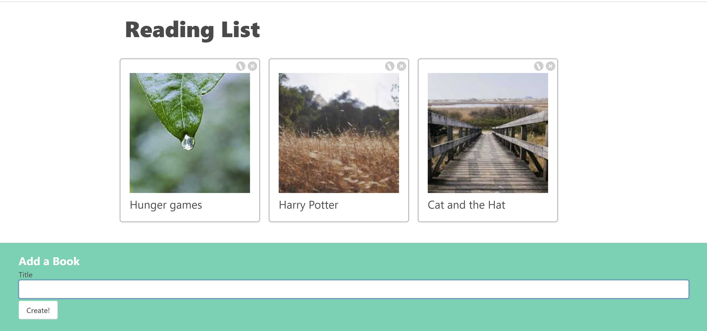

# Books project 

## A React application using the REST Client API to make API requests

click [HERE](https://books-application.vercel.app/?vercelToolbarCode=NJ5eZfy5viD3J5-) to checkout this project

### Summary
This project was a bigger project for me because it had me use APIs, using the Json Server, and using React hooks. This was a great learning opportunity to use React hooks and learn about using context values in React. 

### Author: Calvin Anthony Lee | Software Developer 
[Github](https://github.com/calvinalee2006) |  [LinkedIn](https://www.linkedin.com/in/calvinalee/) | [Website](https://calvins-react-portfolio.vercel.app/)